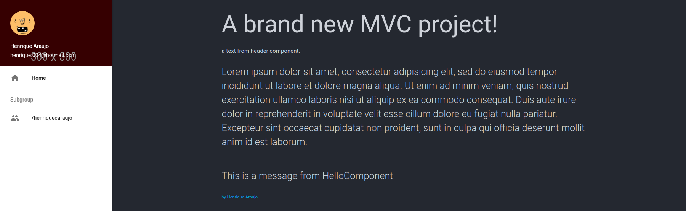

# PHP MVC component based framework

## Getting started

**Requirements**

- PHP 5.6 >
- [Docker Compose](https://docs.docker.com/compose/)
- [Composer](https://getcomposer.org/)

`$ cd php-component-based-framework`

`$ composer install`

`$ docker-compose up`

The application will be served on `https://localhost:8080`

